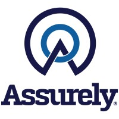
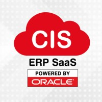

## Assurely
- *Software Engineer* | Apr'23 - Current
- 
- Tags: Work
- Badges:
  - C# [green]
  - MongoDB [green]
  - .NET Core [blue]
  - Blazor [blue]
  - NServiceBus [blue]
- List Items:
  - Remote to USA
  - Worked as full‑stack developer for an insurances platform, using .NET and NServiceBus with a message driven architecture.
  - Developed multiple UI components in Blazor, consuming gRPC services to render data.
  - Designed polymorphic collections in MongoDB and cast them to C# code with Mongoose.
  
## Shoelace Wireless
- *Software Engineer* | Dec'21 - Apr'23
- 
- Tags: Work
- Badges:
  - NodeJS [green]
  - Java [green]
  - MongoDB [green]
  - ExpressJS [blue]
  - Mongoose [blue]
  - AWS [blue]
- List Items:
  - Remote to USA
  - Worked as backend developer using NodeJS, Expressjs and Mongoose.
  - MongoDB database designer and manager.
  - Other responsibilities I had: developed for and Android app in Java, set up engineering and production environments in AWS instances, re‑searched about EAP‑TLS connectivity through a Radius server.

## Bevertec
- *Software Engineer* | Sep'17 - Dec'21
- 
- Tags: Work
- Badges:
  - Java [green]
  - C# [green]
  - SQL [green]
  - Javascript [green]
  - HTML [green]
  - CSS [green]
  - Grails [blue]
  - .NET Framework [blue]
- List Items:
  - Remote to Canada
  - I worked as Full Stack Developer of Alpha Banking (an online core banking system) using Java, Groovy and Grails Framework, and as Lead Developer of Alpha Online (a cross‑platform Internet Banking application) using C# with the .NET Framework, HTML, CSS and Javascript.
  - I reduced the customer’s waiting time for the login and accounts’ retrieving information for the Internet Banking web application by 95% by restructuring the get/post call’s hierarchy and methods to an on‑demand and async approach.
  - I owned the design and development of a corporate version of the Internet Banking application(including new systems like user‑group hierarchy, authorities over accounts, maker‑checker) and was responsible of the launch of retail and corporate versions to multiple banks and institutions, having direct conversation with different third‑party teams and stakeholders.
  - Other responsibilities I had: developed a deployer to different environments, reviewed codes and designs from other teammates, guided new members over the projects, was a main support resource for go‑live periods.

## Cloud Information Solution
- *Software Engineer* | Jan'16 - Feb'17
- 
- Tags: Work
- Badges:
  - Java [green]
  - PL/SQL [green]
  - ADF [blue]
- List Items:
  - Worked as developer for the CIS ERP (a cloud system solution about enterprise resource planning) for clients from Peru, using the Oracle’s development tools: Designer, Forms and Reports
  - Optimized the execution time from minutes to seconds of multiple PL/SQL queries using indexes and advanced commands (like BULK COLLECT and FORALL).
  - Developed a new first version of the ERP in the Oracle’s JDeveloper IDE using Java and the ADF Framework.

## Universidad Peruana de Ciencias Aplicadas
- *Computer Science* | Mar'13 - Dec'17
- 
- Tags: Education
- Badges:
  - Computer Science [green]
  - Algorithms [blue]
  - Software Dev [blue]
  - Game Dev [blue]
- List Items:
  - Top 10% of students in the career
  - Member of the university’s competitive programming official team.