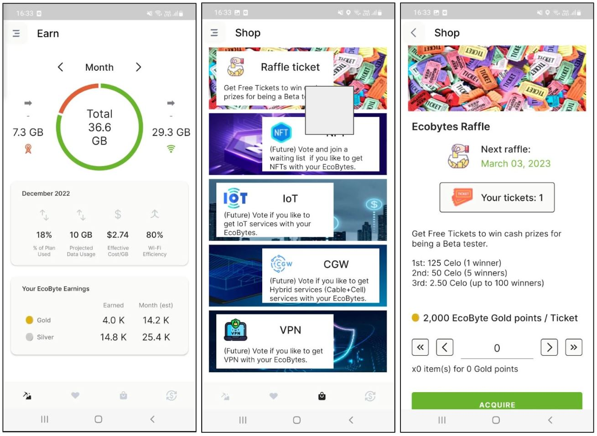
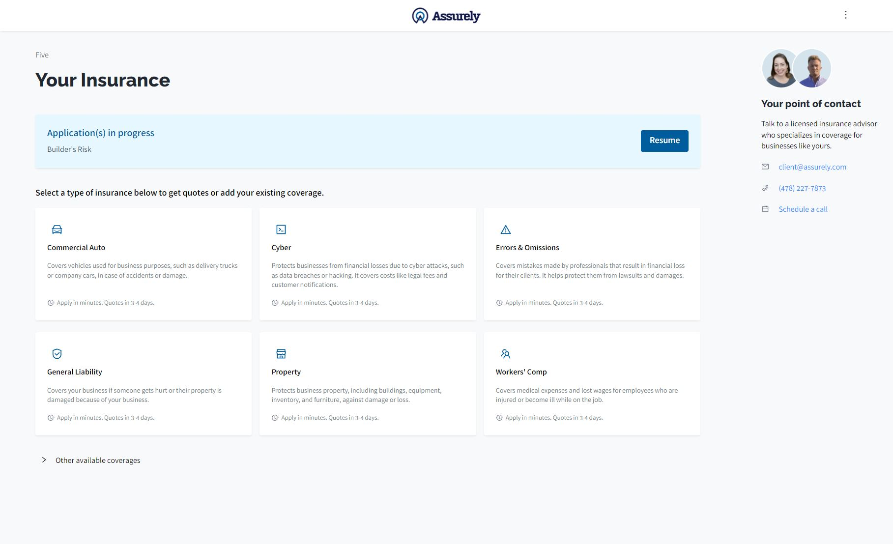
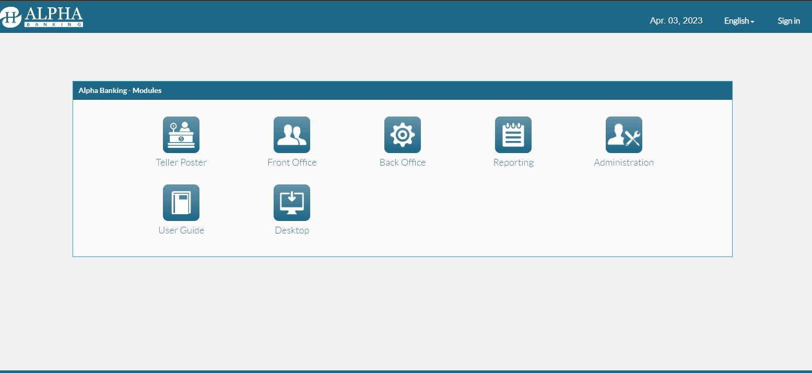
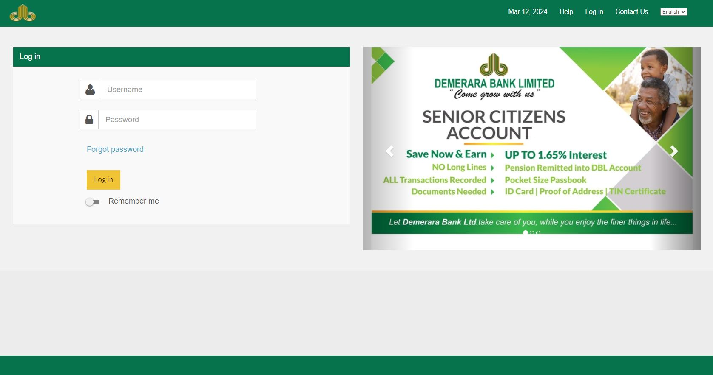

## Future Fitness - Slots App
Developed for Intercorp's FEST_23 festival. Build in React. Randomly creates sentences and consumes an API to display the result image provided by Dall-e.
- 
- Tags: Freelancing
- Badges:
  - React [green]
- Buttons:
  - Link [https://github.com/SebastianJM/slots_ai_app]

## Future Fitness - Drag n Drop
Developed for Intercorp's FEST_23 festival. Build in React. The user can pick words to construct a sentence and the client consumes an API to display the result image provided by Dall-e.
- 
- Tags: Freelancing
- Badges:
  - React [green]
- Buttons:
  - Link [https://github.com/SebastianJM/drag_drop_ai_app]

## Ecobytes
Android and iOS app developed. Worked as backend developer using NodeJS, Expressjs and Mongoose.
- 
- Tags: Company
- Badges:
  - NodeJS [green]
  - Expressjs [blue]
  - Mongoose [blue]
- Buttons:
  - Link [https://play.google.com/store/apps/details?id=com.shoelacewireless.ecobytes&hl=en]

## Assurely
Project built in using .NET Core, Blazor and NServiceBus, with a message driven architecture and a MongoDB database.
- 
- Tags: Personal
- Badges:
  - C# [green]
  - .NET Core [blue]
  - Blazor [blue]
  - NServiceBus [blue]
  - MongoDB [blue]
- Buttons:
  - Link [https://client.assurely.com/]
  
## Alpha Core Banking
Project built using Java, Groovy and Grails Framework. Core banking client that provides capabilities to manage customers, loans, line of credits, saving accounts, general ledger accounts and reporting. Consumes an Oracle SQL database.
- 
- Tags: Company
- Badges:
  - Java [green]
  - Groovy [green]
  - Grails [blue]
- Buttons:

## Alpha Online Banking
Project built using C# with the .NET Framework, HTML, CSS and Javascript. Internet banking client where customers can see their banking products (saving accounts, loans, etc.) and perform transferences to other internal or third party accounts. Consume an Oracle SQL database.
- 
- Tags: Company
- Badges:
  - C# [green]
  - Javascript [green]
  - .NET Framework [blue]
  - HTML [blue]
  - CSS [blue]
- Buttons: